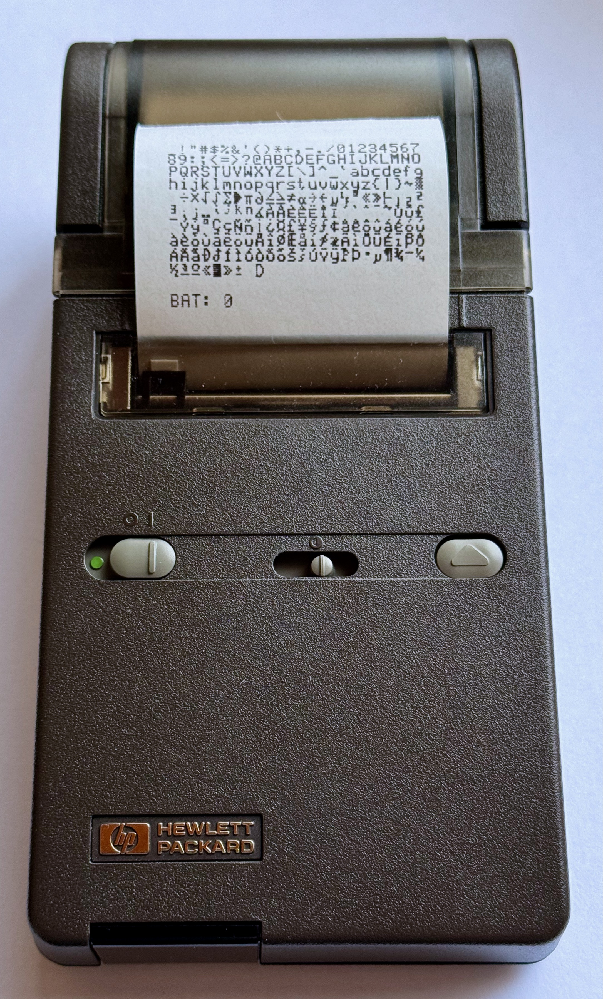
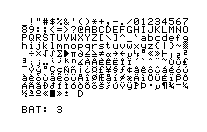
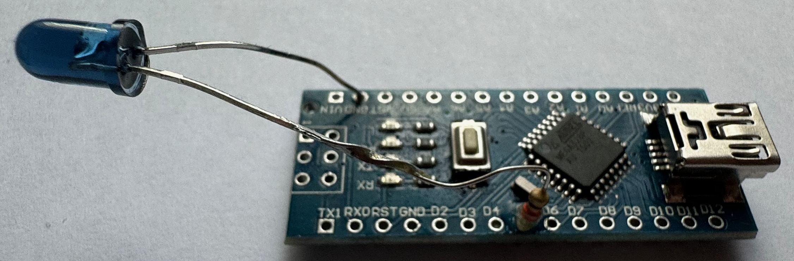

# hp82240

 # General

The Java based HP 82240 is a command line printer simulator for the Hewlett Packard HP-82240A/B 
infrared printer. It will decode printer commands received via a serial port, and produce
a text and a bitmap file.

The printer commands are text strings, escape sequences and line feeds, encoded in a character
set as defined by HP. See [Printer Character Sets](documentation/charactersets/charactersets.md)
for details.

Note that the simulator does not understand the raw infrared pulses generated by the
HP calculators. It needs special hardware (see below) that interprets these pulses and
converts them into bytes.

The output of the simulator consists of two files:
* `Hp8224-Text.txt`: Any text that was sent to the printer, converted from the HP character set into UTF-8. 
* `Hp8224-Image.png`: Text and graphics as they would look on the printer paper.

To illustrate, see the actual printer on the left, and the generated bitmap file on the right:

| Printer                                                                             | Simulated Output                                                                                       |
|-------------------------------------------------------------------------------------|--------------------------------------------------------------------------------------------------------|
|  |  |

More examples are available [here](documentation/examples.md) and
[here](documentation/validation/validation.md).

# Acknowledgements
* Thanks to <a href="http://hp.giesselink.com/">Christoph Gießelink</a>: He develops
a Windows based simulator of the HP printers 82240A/B and 82143A. The bitmaps for the
printer characters directly come from this simulator (See
<a href="https://www.hpcalc.org/details/7386">hpcalc.org</a>
for the full source code)
* Thanks to [Martin Hepperle](https://www.mh-aerotools.de): He developed the first
"Red Eye" reader, see "Hardware" section below.
* Thanks to [Meindert Kuipers](https://www.hpmuseum.org/forum/user-215.html): His version
of the "Red Eye" receiver is the one that I am using.
* Thanks to Christian Vogel; His [avr-redeye](https://github.com/vogelchr/avr-redeye) project allowed me to send any print commands
that I like to my real HP 82240A printer and observe its behaviour.

# Installation
Copy the `hp82240.jar` file to a convenient location. Make sure to have a Java 17 or higher
runtime available on your system. Then, start the simulator with:  
`java -jar hp82240.jar [-p=comport]`  
This will start the simulator and open the com port for reading. Any existing output files
(`Hp8224-Text.txt` and `Hp8224-Image.png`) will be overwritten on application startup.  
When you are done with your session stop the simulator with `Ctrl-C`. Save away the output
files for later use.  
If you omit the com port, the simulator will attempt to auto-detect the correct port.

## Quick testing
For some quick testing, the simulator can work with input files. To produce a self test,
one can use this: `java -jar hp82240.jar -i selftest.yaml`. The files are the same ones as used
in the Red Eye sender (see below). The file format is not explicitly documented, but should
be self explanatory when looking at the provided samples.

## Receiver Hardware
To receive the infrared pulses from an actual calculator, and convert this data to a serial stream,
special hardware is required. I built a receiver based on
[this](https://www.hpmuseum.org/forum/thread-14858.html) guideline, which in turn is a
modified version of
[this](https://www.mh-aerotools.de/hp/red-eye/HP-IR%20Receiver%20with%20Arduino.pdf)
guideline.

# Comparison with other simulators
This simulator is currently limited in functionality, supporting only the HP 82240A/B printer,
and lacking a graphical user interface. Its main advantage is that it runs on all platforms
supporting a Java 17 or higher runtime, including ARM devices such as the Raspberry Pi. 

# Validation on a real HP82240A printer
To [validate](documentation/validation/validation.md) and compare any output generated by
this simulator with the output from a real
HP 82240A printer, one needs to be able to send very specific strings / graphic codes to
the printer. The real calculators are only of limited use here, because their firmware
prevents certain issues to happen. For example, lines that are too long (longer than the
printers buffer) get Line Feeds added by the firmware.

Therefore, a tool has been developed that allows to send any sequence of bytes that one wants
to a serial port. On this serial port a piece of hardware is required that generates the
"Red Eye" pulses that the printer understands.

## Sender Hardware

I am using this project with an Arduino clone and a simple IR diode:
[avr-redeye](https://github.com/vogelchr/avr-redeye). The project is a few years old, but it works perfectly right out of
the box. Note that you can't use the Arduino IDE to compile / send, because this is pure
C code and not an Arduino sketch. On the Mac I installed two tools:
* `brew install avrdude`
* `brew install avr-gcc`

I had to slightly adapt the `PROGRAMMER_DUDE` part of the `Makefile`
to  
`PROGRAMMER_DUDE = -P/dev/cu.usbmodem4101 -carduino -b57600`, and then it worked right away.

For the first test I used a genuine Arduino Uno, and found that this device sends spurious
bytes (`0xF0`) when the serial port gets closed (which happens automatically at the end of
the application). So if you see strange characters on your printer, try with a different
type of Arduino. Here is the device that I am using now:

## Sending print commands

The tool is invoked as follows:
`java -cp hp82240.jar ch.erzberger.emulation.sender.RedEyeSender`. It will then tell you
the necessary parameters. Some sample files are provided in the
`documentation/sampleoutput` directory.

# Stdin, Stdout
The simulator can read from Stdin instead of from a serial port. Use this if you have e.g.
an emulator of a calculator that sends print output to Stdout. To test, use the RedEyeSender, 
sending to StdOut:   
`java -cp hp82240.jar ch.erzberger.emulation.sender.RedEyeSender -p=stdout -i=selftest.yaml | java -jar hp82240.jar -p stdin`

# License
HP82240 - A Java based HP 82240A/B Printer Simulator
Copyright (C) 2023 Martin Erzberger.

This program is free software; you can redistribute it and/or modify it under the terms
of the GNU General Public License Version 2 or any later version, as published by the Free
Software Foundation.
