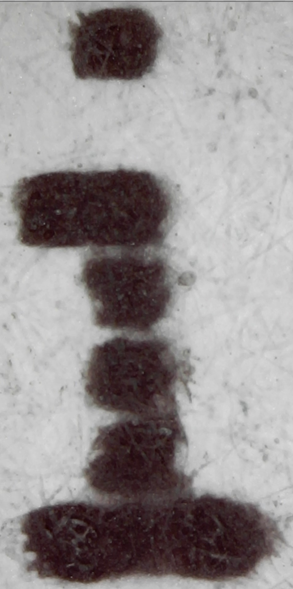
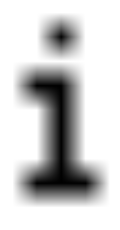
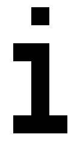
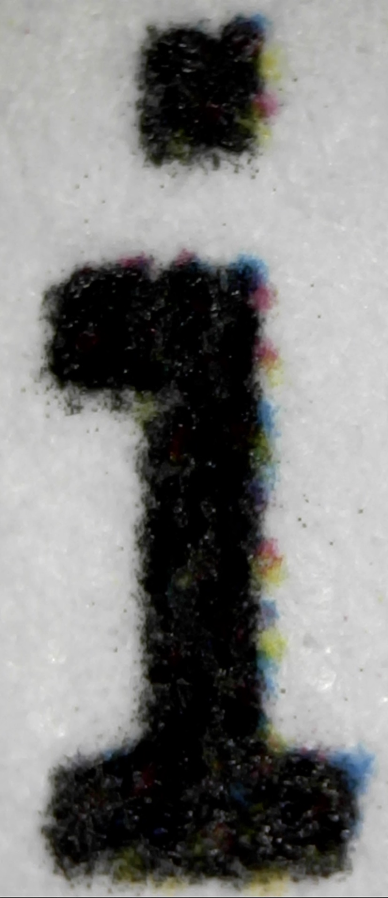
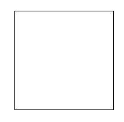
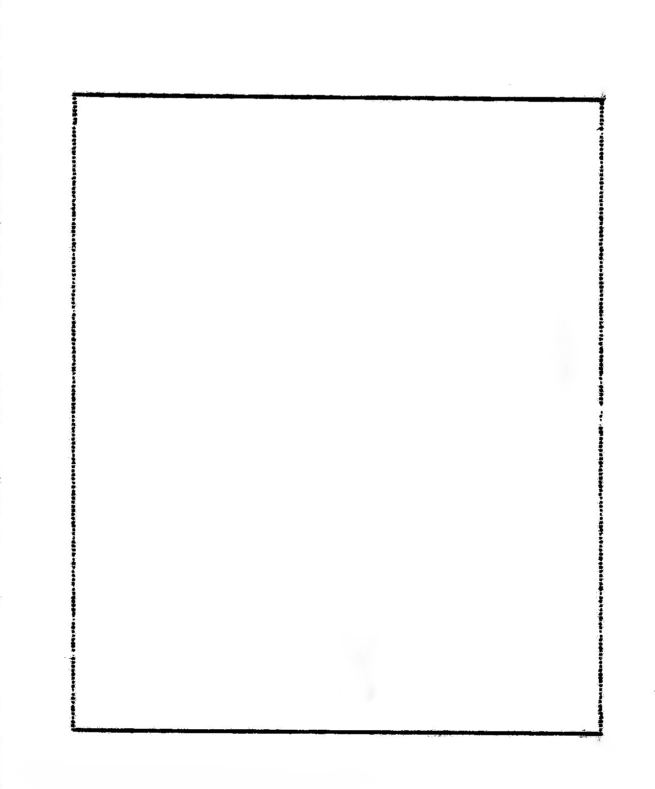

# Aspect Ratio and Pixel Dimensions

## The HP 82240A Printer

The HP 82240A printer has somewhat oval / rectangular pixels, because it is an analog device. Also,
horizontal neighbouring pixels tend to bleed over because the printer head can't cool down quickly enough.

This is how the printout looks under a microscope:

## Digital pixels

Digital pixels are abstractions that only become visible when shown on a device, or printed out on
a computer printer. How these pixels are represented differs from device to device, and from application
to application. Here are just three examples of the same letter "i".

| Quick View                            | Preview                             | Laser                                    |
|---------------------------------------|-------------------------------------|------------------------------------------|
|  |  |  |

The laser-printer shows the closest result, because the aspect ratio is actually correct. Unlike the
HP printer, the vertical pixels merge together, though.

## One pixel per pixel, or many?

Because the original HP 82240a pixels are not perfect squares, the simulated printer output might look
different from the original. One can deal with this in two ways:
1. Use multiple pixels to assemble small ovals, and then use one oval for each printer pixel. For absolutely
perfect results, one would need different ovals, depending on the neighbouring pixels.
2. Use one pixel per printer pixel, and define at least the correct aspect ratio in the file's metadata.

Option one gives the closest look to the original, at the cost of increasing the file size significantly, and of
limiting the flexibility in using the resulting file. Because there is no universally "better" option,
it would be best to support both options and have the user decide.

For now, only option two is supported, though. The rest of this document explains how the aspect ratio and the
pixel density have been determined.

## Figuring out the pixel dimensions of the HP 84440a printer

First, we print a perfect 166 x 166 pixel rectangle, using the file  [dimensions.yaml](../sampleoutput/dimensions.yaml).

The printed output can then be measured, and the resulting width/height is:
* Width: 46.1mm, which is 92dpi horizontal resolution
* Heigth: 55.2mm, which is 76dpi vertical resolution

These dpi values are written into the `png` output file as metadata. As one can see above, the laser-printer
uses the annotation to correct the aspect ratio of the printout.

So far I found no application or browser that will correct the aspect when displaying the image on screen.
Please let me know if the left picture (from the simulator) looks the same as the right one
(from the HP 82240a printer).

| Simulator                             | HP 82240a                             |
|---------------------------------------|---------------------------------------|
|  |  |
