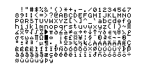

# Printer Character Sets

## Acknowledgment
Creating a bitmap character set is tedious work. It needs to be assembled dot by dot
from enlarged original printouts. Luckily, I did not have to do this. The bitmaps
are copied from [Christoph Gießelink's](http://hp.giesselink.com/) simulator, available
[here](www.hpcalc.org/details/7386).

I performed my own validation with enlarged printouts, and found a number of differences
in the HP 82240A's Roman 8 character set (e.g. in the number "3", or the letter "J").
These have been changed to match the original printer.  
TODO: Validate the two HP82240B character sets.

## HP Modified Roman 8 Character Set
The original HP 82240A printer uses a modified HP Roman 8 character set. See
[Wikipedia](https://en.wikipedia.org/wiki/HP_Roman#Modified_Roman-8) for details.
The successor HP82240B also supports this character set, in order to be compatible
with the A model. Even though the B model supports the same charset, it is rendered
quite differently. For example, all capital letters haven been shortened by one row
compared to the A model.

## RPL Character Set
The newer HP 82240B model additionally supports the "RPL" character set, see
[Wikipedia](https://en.wikipedia.org/wiki/RPL_character_set). This character set is used by HP calculators that came after the HP 28,
such as the HP 48 or 50 series.
This character set is enabled with `ESC-0xF9` and disabled with `ESC-0xF8`.
The "A" model ignores this escape sequence.

## Examples (generated by the simulator)

| HP 82240A Roman 8                           | HP 82240B Roman 8                           | HP 82240B RPL                            |
|---------------------------------------------|---------------------------------------------|------------------------------------------|
|  |  |  |

## FOCAL character set
The FOCAL character set (see [Wikipedia](https://en.wikipedia.org/wiki/FOCAL_character_set)) is
used by the HP 41C calculator and its printer, the HP 82143A. It contains 128 characters.
The simulator does not currently support this printer. The character set is part of the
class "HpPrinterFonts", but it's not currently in use. The bitmaps for the characters were
converted from the original printer ROM, see the `CharRomToJavaArray.java` file for more details.

| Focal Characterset                |
|-----------------------------------|
|  |
