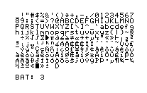

# Example outputs
## Screenshot from an HP 50g calculator
The HP50g calculator can send a screenshot to the printer. For this to work, the
print output must be directed to infrared ("Mode", "Flags": Number 34 must be "Print via IR").  
To print, press "APPS", "2", "Enter", "3", "Enter".  
All of the output is sent in graphics mode, even if it appears to be text or numbers.

|Calculator|Printer Output|Simulator Output|
|-|-|-|
||||

## Self test
The printer can perform a self test. This is initiated by holding the paper feed key while
turning on the printer, or by sending ESC + 0xFE to the printer. The self test is emulated
as well, and will output both a text file and a png file. The text file is in UTF-8 and
contains all of the printer's characters.

|Printer Output|Simulated Output|
|-|-|
|||

This is the emulated self test output in text form:
[SelfTest.txt](pictures/SelfTest.txt)

## HP 41C Printing
The original printer for the HP 41C calculator is the HP 82143A. This printer is connected via
cable to one of the expansion slots. The connector also contains the printer commands
in ROM, such as `PRA` or `PRPLOT` (see below). This printer supports 128 characters, numbered
from 0 to 127.

The HP 82240A came later, and contains a different character set. It has printable characters
from 32 up to 255. To print to this printer, an IR emitting diode is needed, which is plugged
into an expansion slot of the HP 41C (the HP 82242A module). Just like with the 82143A
printer, this module contains the printer ROM.

Even though the newer printer has more printable characters, the older printer still has
about 15 characters that do not exist on the newer printer. The ROM takes care of some things:
* It translates the 82143A character codes into equivalent 82240A codes
* It converts the flag for double wide into escape sequences
* For three of the not existing characters (up and down arrow, and diamond), it transparently
uses the 82240A graphic mode to generate the output. This routine seems to be buggy,
though, because if a full line of 32 characters is printed, the last two do not print
correctly.
* The other unsupported characters are replaced with a `¤` character.

## PRPLOT
The [HP 82143A printer manual](https://literature.hpcalc.org/community/hp82143a-oh-en.pdf)
explains how to use the interactive plotting function of the printer ROM. The interesting
part is that the printer ROM of the DM41X uses a mix of text and graphics output,
because it simulates non existing characters via graphics mode (see paragraph above).
This is the text output: [Prplot-Wiggle.txt](pictures/Prplot-Wiggle.txt). Note that it misses
the down arrow on the second line, because this arrow is generated in graphics mode. The
right arrow on line 3 is visible though, because this arrow is part of the character set
of the 82240A printer.

The simulated output is here:  
