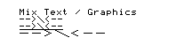

# Validation
The HP 82240A printer must deal with two exception cases:
* Line overflow: More than 24 chars / 166 dots are sent to the printer, before a line
feed is sent. The printer will overflow the extra chars / dots to the next line.
* Buffer overflow: The 200 byte printer buffer overflows while printing, or even
before the printer starts printing (i.e. more than 200 bytes are sent before a line
feed is sent). The printer will mark the position of the overflow with a special
character in the output, and discard all data afterwards until the next line feed.

To test these scenarios, a number of print scripts have been developed. The output
of the real printer, and the output of the simulator are shown next to each other in
order to compare the two.

## Mix of text and graphics
In this test, we mix text and graphics on the same line. The printout is also tested
with underscore and doublewide active. The expectation is that underline / doublewide
also affect the graphic output, and not only the text.  
The file used to print is [mix_text_graphics.yaml](../sampleoutput/mix_text_graphics.yaml).

|Printer| Simulator                                     |
|-|-----------------------------------------------|
||  |

## Graphics overflow
In this test, the graphics (an arrow) at the end of the line does not fit by two rows.
The expectation is that last 2 dots of the arrow flow over to the next line.  
The file used to print is [graphics_overflow.yaml](../sampleoutput/graphics_overflow.yaml).

| Printer                                       |Simulator|
|-----------------------------------------------|-|
|  ||

## Text overflow
Unlike graphics, a text character is not split. If it doesn't fit fully, it is overflown in its
entirety. Validate by printing a 100% full line, followed by a line exactly one dot too long.
The file used to print is [text_overflow.yaml](../sampleoutput/text_overflow.yaml).

| Printer                                   | Simulator                                 |
|-------------------------------------------|-------------------------------------------|
|  |  |

## Buffer overflow
In this test, exactly 203 bytes are sent (3 chars, and 10 graphics blocks using 10 bytes each),
followed by a line feed. The expectation is that the last three bytes of the last arrow
are missing, and instead the special "buffer overflow" character is printed. Note that the 
line is split, because it is also too long to fit.  
The file used to print is [buffer_overflow.yaml](../sampleoutput/buffer_overflow.yaml).

As one can see, the simulator does not yet handle a buffer overflow correctly.

| Printer                                     | Simulator                                   |
|---------------------------------------------|---------------------------------------------|
|  |  |
